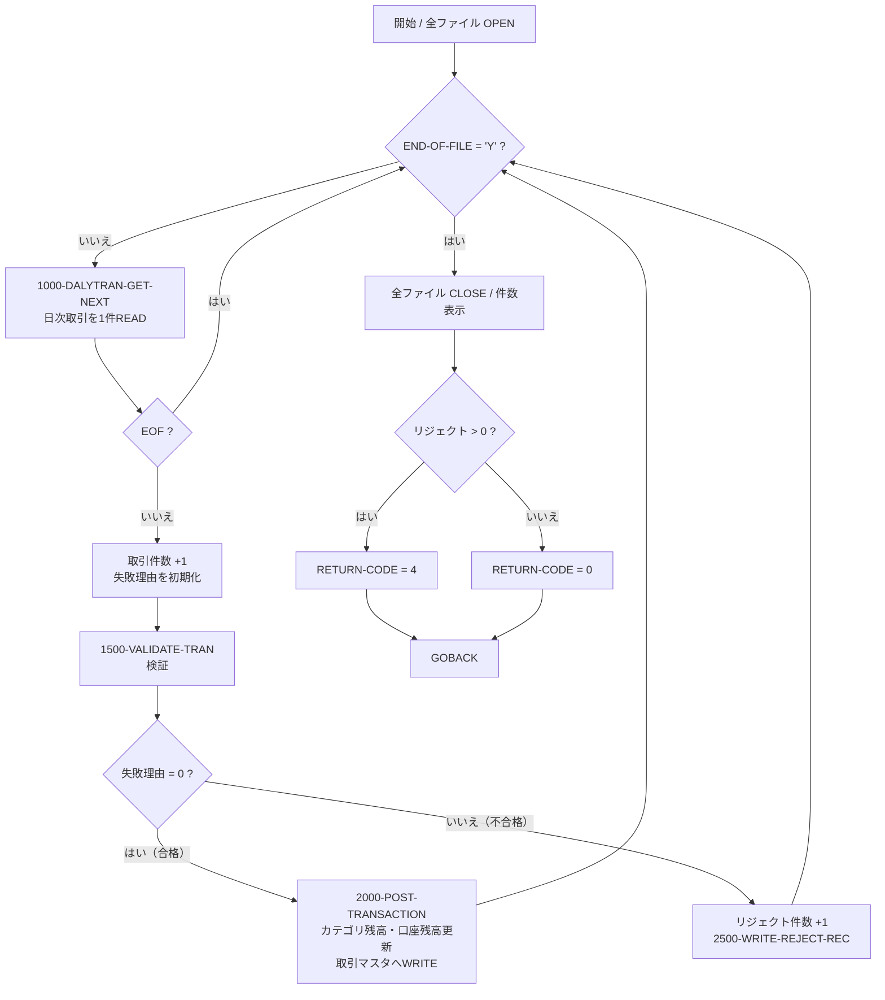
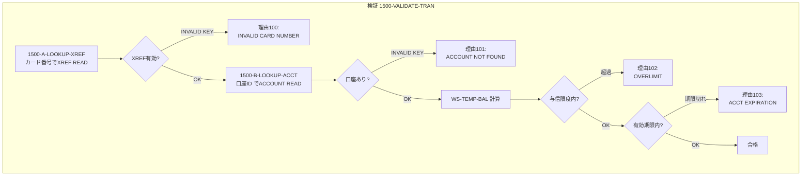

# 詳細設計書 — 取引ポスティング処理 `CBTRN02C`（バッチジョブ `POSTTRAN`）

> 本書は CardDemo アプリケーション（`xxxxxtech/aws-mainframe-modernization-carddemo`、ブランチ `main`）の
> バッチ COBOL プログラム `CBTRN02C` を、ソースコードの解析（リバースエンジニアリング）により
> 詳細設計書として再構成したものである。記述は原則としてソースコードの実際の行を根拠とし、
> **事実**（コードに書かれている内容）と**推測**（設計意図の解釈・モダナイゼーションの提案）を区別する。
> 推測部分には「（推測）」を明記する。

---

## 1. ドキュメント情報

| 項目 | 内容 |
| --- | --- |
| 対象プログラム | `CBTRN02C` |
| 種別 | バッチ COBOL プログラム |
| ジョブ名 | `POSTTRAN` |
| 機能 | 日次取引ファイルのレコードを検証し、口座残高・取引カテゴリ残高へ反映する（Post the records from daily transaction file） |
| 作成方式 | リバースエンジニアリング（ソースコード解析） |
| 対象リポジトリ / ブランチ | `xxxxxtech/aws-mainframe-modernization-carddemo` / `main` |
| プログラム版数（ソース末尾） | `CardDemo_v2.0-25-gdb72e6b-235`（2025-04-29） |

### 解析対象ファイル

| 種別 | パス | 用途 |
| --- | --- | --- |
| 主対象プログラム | `app/cbl/CBTRN02C.cbl`（731 行） | 取引ポスティング本体 |
| 起動 JCL | `app/jcl/POSTTRAN.jcl` | `EXEC PGM=CBTRN02C`、DD 定義 |
| スケジューラ定義 | `app/scheduler/CardDemo.ca7` | CA-7 上の `POSTTRAN` 登録・トリガ関係 |
| スケジューラ定義 | `app/scheduler/CardDemo.controlm` | Control-M 定義（関連取引系ジョブ） |
| コピーブック | `app/cpy/CVTRA06Y.cpy` | 日次取引レコード `DALYTRAN-RECORD` |
| コピーブック | `app/cpy/CVTRA05Y.cpy` | 取引マスタレコード `TRAN-RECORD` |
| コピーブック | `app/cpy/CVACT03Y.cpy` | カード相互参照レコード `CARD-XREF-RECORD` |
| コピーブック | `app/cpy/CVACT01Y.cpy` | 口座レコード `ACCOUNT-RECORD` |
| コピーブック | `app/cpy/CVTRA01Y.cpy` | 取引カテゴリ残高レコード `TRAN-CAT-BAL-RECORD` |

---

## 2. 機能概要

`CBTRN02C` は、日次で収集された取引データ（`DALYTRAN` ファイル）を 1 件ずつ読み込み、
以下を行うバッチ処理である。

1. **検証（バリデーション）**：カード番号がカード相互参照ファイル（XREF）に存在するか、
   対応する口座が存在するか、与信限度内か、口座有効期限内か、を判定する（`1500-VALIDATE-TRAN`）。
2. **ポスティング（反映）**：検証に合格した取引について、取引カテゴリ残高（`TCATBAL`）と
   口座残高（`ACCOUNT`）を更新し、取引マスタ（`TRANSACT`）へ登録する（`2000-POST-TRANSACTION`）。
3. **リジェクト出力**：検証で不合格となった取引は、理由コード付きで日次リジェクトファイル
   （`DALYREJS`）へ出力する（`2500-WRITE-REJECT-REC`）。
4. **集計・終了**：処理件数（`WS-TRANSACTION-COUNT`）とリジェクト件数（`WS-REJECT-COUNT`）を
   `DISPLAY` で出力し、リジェクトが 1 件以上あれば `RETURN-CODE` に 4 を設定して終了する
   （`app/cbl/CBTRN02C.cbl` 227-232 行）。

処理は 1 レコード単位の READ → 検証 → 更新のループ構造であり、日次取引ファイルの
EOF まで繰り返す（193-234 行）。

---

## 3. 起動条件・JCL・パラメータ・実行スケジュール

### 3.1 JCL（`app/jcl/POSTTRAN.jcl`）

- ジョブ名：`POSTTRAN`（`CLASS=A`, `MSGCLASS=0`, `NOTIFY=&SYSUID`）
- 実行ステップ：`STEP15`、`EXEC PGM=CBTRN02C`
- ロードライブラリ：`STEPLIB DD DSN=AWS.M2.CARDDEMO.LOADLIB`（`DISP=SHR`）
- 実行時パラメータ（`PARM`）：**なし**（コード上も `LINKAGE SECTION` は存在せず、パラメータ受け渡しは行っていない）（事実）

### 3.2 DD 名とデータセットの対応

| DD 名 | データセット | DISP | 備考 |
| --- | --- | --- | --- |
| `TRANFILE` | `AWS.M2.CARDDEMO.TRANSACT.VSAM.KSDS` | SHR | 取引マスタ（VSAM KSDS） |
| `DALYTRAN` | `AWS.M2.CARDDEMO.DALYTRAN.PS` | SHR | 日次取引（順次ファイル） |
| `XREFFILE` | `AWS.M2.CARDDEMO.CARDXREF.VSAM.KSDS` | SHR | カード相互参照（VSAM KSDS） |
| `DALYREJS` | `AWS.M2.CARDDEMO.DALYREJS(+1)` | NEW,CATLG,DELETE | リジェクト出力（GDG、`RECFM=F, LRECL=430`） |
| `ACCTFILE` | `AWS.M2.CARDDEMO.ACCTDATA.VSAM.KSDS` | SHR | 口座（VSAM KSDS） |
| `TCATBALF` | `AWS.M2.CARDDEMO.TCATBALF.VSAM.KSDS` | SHR | 取引カテゴリ残高（VSAM KSDS） |

`DALYREJS` の `LRECL=430` は、リジェクトレコードのレイアウト（取引データ 350 バイト＋
バリデーショントレーラ 80 バイト＝430 バイト）と一致する（`REJECT-RECORD`、176-178 行）。（事実）

### 3.3 実行スケジュール（`app/scheduler/CardDemo.ca7`）

CA-7 のジョブフロー上、`POSTTRAN` は以下のトリガ関係に位置する（事実）。

- 先行ジョブ `CBPAUP0J` の完了により `POSTTRAN` がトリガされる（`JOB=POSTTRAN SCHID=030`、70 行）。
- `POSTTRAN` の完了は後続 `WAITSTEP` をトリガする（97 行）。以降 `OPENFIL` 等の
  ファイル開放系ジョブが続く（推測：CICS ファイルのゲーティング／再オープンの流れ）。
- ジョブ属性：`CLASS=`（既定）, `MSGCLASS=A`, `REGION=4096K`, `SCHID=030`（78・91 行）。

`app/scheduler/CardDemo.controlm`（Control-M 定義）には `POSTTRAN`／`CBTRN02C` の
定義は**存在しない**。同ファイルには関連する取引系ジョブとして `TRANBKP`（日次取引バックアップ）、
`COMBTRAN`（月次）、`TRANEXTR`（週次）が定義されている。（事実）

---

## 4. 入出力ファイル一覧

`FILE-CONTROL`（`app/cbl/CBTRN02C.cbl` 28-61 行）および `FD`（66-97 行）を根拠とする。

| 論理名（SELECT） | DD 名 | 編成 / アクセス | レコードキー | 区分 | 用途 |
| --- | --- | --- | --- | --- | --- |
| `DALYTRAN-FILE` | `DALYTRAN` | 順次 / SEQUENTIAL | — | 入力 | 日次取引データの読み込み |
| `TRANSACT-FILE` | `TRANFILE` | 索引 / RANDOM | `FD-TRANS-ID` | 出力 | 検証済み取引の登録（WRITE） |
| `XREF-FILE` | `XREFFILE` | 索引 / RANDOM | `FD-XREF-CARD-NUM` | 参照 | カード番号→口座 ID の解決（READ） |
| `DALYREJS-FILE` | `DALYREJS` | 順次 / SEQUENTIAL | — | 出力 | リジェクト取引の書き出し |
| `ACCOUNT-FILE` | `ACCTFILE` | 索引 / RANDOM | `FD-ACCT-ID` | 更新 | 口座残高の参照・更新（READ/REWRITE） |
| `TCATBAL-FILE` | `TCATBALF` | 索引 / RANDOM | `FD-TRAN-CAT-KEY` | 更新 | カテゴリ残高の参照・作成・更新（READ/WRITE/REWRITE） |

各ファイルには `FILE STATUS` 項目（`DALYTRAN-STATUS` 等）が割り当てられ、
入出力の成否判定に用いられる。（事実）

---

## 5. レコードレイアウト

### 5.1 日次取引レコード `DALYTRAN-RECORD`（`CVTRA06Y.cpy`、RECLN=350）

| 項目 | PIC | 桁数 | 説明 |
| --- | --- | --- | --- |
| `DALYTRAN-ID` | `X(16)` | 16 | 取引 ID |
| `DALYTRAN-TYPE-CD` | `X(02)` | 2 | 取引種別コード |
| `DALYTRAN-CAT-CD` | `9(04)` | 4 | 取引カテゴリコード |
| `DALYTRAN-SOURCE` | `X(10)` | 10 | 取引発生元 |
| `DALYTRAN-DESC` | `X(100)` | 100 | 取引説明 |
| `DALYTRAN-AMT` | `S9(09)V99` | 11 | 取引金額（符号付・小数 2 桁） |
| `DALYTRAN-MERCHANT-ID` | `9(09)` | 9 | 加盟店 ID |
| `DALYTRAN-MERCHANT-NAME` | `X(50)` | 50 | 加盟店名 |
| `DALYTRAN-MERCHANT-CITY` | `X(50)` | 50 | 加盟店所在都市 |
| `DALYTRAN-MERCHANT-ZIP` | `X(10)` | 10 | 加盟店郵便番号 |
| `DALYTRAN-CARD-NUM` | `X(16)` | 16 | カード番号 |
| `DALYTRAN-ORIG-TS` | `X(26)` | 26 | 取引発生タイムスタンプ |
| `DALYTRAN-PROC-TS` | `X(26)` | 26 | 取引処理タイムスタンプ |
| `FILLER` | `X(20)` | 20 | 予備 |

### 5.2 取引マスタレコード `TRAN-RECORD`（`CVTRA05Y.cpy`、RECLN=350）

レイアウトは `DALYTRAN-RECORD` と同一構造（項目名の接頭辞が `TRAN-`）。
`2000-POST-TRANSACTION` で日次取引の各項目を対応する `TRAN-` 項目へ MOVE する。（事実）

### 5.3 カード相互参照レコード `CARD-XREF-RECORD`（`CVACT03Y.cpy`、RECLN=50）

| 項目 | PIC | 桁数 | 説明 |
| --- | --- | --- | --- |
| `XREF-CARD-NUM` | `X(16)` | 16 | カード番号（キー） |
| `XREF-CUST-ID` | `9(09)` | 9 | 顧客 ID |
| `XREF-ACCT-ID` | `9(11)` | 11 | 口座 ID |
| `FILLER` | `X(14)` | 14 | 予備 |

### 5.4 口座レコード `ACCOUNT-RECORD`（`CVACT01Y.cpy`、RECLN=300）

| 項目 | PIC | 桁数 | 説明 |
| --- | --- | --- | --- |
| `ACCT-ID` | `9(11)` | 11 | 口座 ID（キー） |
| `ACCT-ACTIVE-STATUS` | `X(01)` | 1 | 有効状態 |
| `ACCT-CURR-BAL` | `S9(10)V99` | 12 | 現在残高 |
| `ACCT-CREDIT-LIMIT` | `S9(10)V99` | 12 | 与信限度額 |
| `ACCT-CASH-CREDIT-LIMIT` | `S9(10)V99` | 12 | キャッシング限度額 |
| `ACCT-OPEN-DATE` | `X(10)` | 10 | 開設日 |
| `ACCT-EXPIRAION-DATE` | `X(10)` | 10 | 有効期限（※原文綴りのまま） |
| `ACCT-REISSUE-DATE` | `X(10)` | 10 | 再発行日 |
| `ACCT-CURR-CYC-CREDIT` | `S9(10)V99` | 12 | 当月クレジット累計 |
| `ACCT-CURR-CYC-DEBIT` | `S9(10)V99` | 12 | 当月デビット累計 |
| `ACCT-ADDR-ZIP` | `X(10)` | 10 | 住所郵便番号 |
| `ACCT-GROUP-ID` | `X(10)` | 10 | 開示グループ ID |
| `FILLER` | `X(178)` | 178 | 予備 |

> 補足：項目名 `ACCT-EXPIRAION-DATE` は綴りに誤りがあるが、コピーブックの定義どおりに記載している。（事実）

### 5.5 取引カテゴリ残高レコード `TRAN-CAT-BAL-RECORD`（`CVTRA01Y.cpy`、RECLN=50）

| 項目 | PIC | 桁数 | 説明 |
| --- | --- | --- | --- |
| `TRAN-CAT-KEY` | — | 17 | 複合キー（下記 3 項目） |
| &nbsp;&nbsp;`TRANCAT-ACCT-ID` | `9(11)` | 11 | 口座 ID |
| &nbsp;&nbsp;`TRANCAT-TYPE-CD` | `X(02)` | 2 | 取引種別コード |
| &nbsp;&nbsp;`TRANCAT-CD` | `9(04)` | 4 | 取引カテゴリコード |
| `TRAN-CAT-BAL` | `S9(09)V99` | 11 | カテゴリ別残高 |
| `FILLER` | `X(22)` | 22 | 予備 |

> 補足：金額項目はいずれも表示形式（`DISPLAY`）の符号付・小数 2 桁であり、COMP-3（パック 10 進）ではない。（事実）

---

## 6. 処理フロー

### 6.1 主処理（`PROCEDURE DIVISION`、193-234 行）

1. 開始メッセージ表示（194 行）
2. 全ファイル OPEN（`0000`〜`0500`、195-200 行）
3. EOF まで以下を繰り返す（202-219 行）
   - `1000-DALYTRAN-GET-NEXT` で 1 件読み込み
   - EOF でなければ処理件数 +1、失敗理由を初期化
   - `1500-VALIDATE-TRAN` を実行
   - `WS-VALIDATION-FAIL-REASON = 0` なら `2000-POST-TRANSACTION`
   - それ以外はリジェクト件数 +1 のうえ `2500-WRITE-REJECT-REC`
4. 全ファイル CLOSE（`9000`〜`9500`、221-226 行）
5. 処理件数・リジェクト件数を表示（227-228 行）
6. リジェクトが 1 件以上なら `RETURN-CODE = 4`（229-231 行）
7. 終了メッセージ表示・`GOBACK`（232-234 行）

### 6.2 フローチャート（mermaid）





---

## 7. 段落（PARAGRAPH）別ロジック仕様

### 7.1 `1000-DALYTRAN-GET-NEXT`（345-369 行）
- `DALYTRAN-FILE` を `READ ... INTO DALYTRAN-RECORD`。
- ステータス `00`：正常。`10`：EOF（`APPL-EOF` → `END-OF-FILE = 'Y'`）。それ以外：異常
  （IO ステータス表示 → ABEND）。

### 7.2 `1500-VALIDATE-TRAN`（370-378 行）
- `1500-A-LOOKUP-XREF` を実行。失敗理由が 0 のときのみ `1500-B-LOOKUP-ACCT` を実行。
- `* ADD MORE VALIDATIONS HERE`（377 行）という**拡張余地を示すコメント**が存在する（事実）。
  今後の検証追加ポイントとして意図されている（推測）。

### 7.3 `1500-A-LOOKUP-XREF`（380-392 行）
- `DALYTRAN-CARD-NUM` を `FD-XREF-CARD-NUM` に MOVE し、`XREF-FILE` を READ。
- `INVALID KEY`：理由コード **100**「`INVALID CARD NUMBER FOUND`」を設定。
- 正常時：`XREF-ACCT-ID` 等が `CARD-XREF-RECORD` に取得される。

### 7.4 `1500-B-LOOKUP-ACCT`（393-422 行）
- `XREF-ACCT-ID` を `FD-ACCT-ID` に MOVE し、`ACCOUNT-FILE` を READ。
- `INVALID KEY`：理由コード **101**「`ACCOUNT RECORD NOT FOUND`」を設定。
- 正常時：
  - 与信判定用の見込み残高 `WS-TEMP-BAL` を計算（403-405 行、後述 9.1）。
  - `ACCT-CREDIT-LIMIT >= WS-TEMP-BAL` を満たさなければ理由コード **102**「`OVERLIMIT TRANSACTION`」。
  - `ACCT-EXPIRAION-DATE >= DALYTRAN-ORIG-TS (1:10)` を満たさなければ理由コード **103**
    「`TRANSACTION RECEIVED AFTER ACCT EXPIRATION`」。

### 7.5 `2000-POST-TRANSACTION`（424-444 行）
- 日次取引の各項目を取引マスタ項目（`TRAN-*`）へ MOVE。
- `Z-GET-DB2-FORMAT-TIMESTAMP` で処理タイムスタンプを生成し `TRAN-PROC-TS` に設定。
- 続けて `2700-UPDATE-TCATBAL` → `2800-UPDATE-ACCOUNT-REC` → `2900-WRITE-TRANSACTION-FILE` を実行。

### 7.6 `2700-UPDATE-TCATBAL` / `2700-A-CREATE-TCATBAL-REC` / `2700-B-UPDATE-TCATBAL-REC`（467-542 行）
- キー（`口座ID + 種別 + カテゴリ`）で `TCATBAL-FILE` を READ。
- `INVALID KEY`（レコード未存在）：`WS-CREATE-TRANCAT-REC = 'Y'` として新規作成へ分岐。
  - ステータス `00` または `23`（未存在）を正常扱いとする（481 行）。
- 新規（`2700-A`）：レコードを初期化しキーと金額を設定して WRITE（503-524 行）。
- 更新（`2700-B`）：`TRAN-CAT-BAL` に金額を加算して REWRITE（526-542 行）。

### 7.7 `2800-UPDATE-ACCOUNT-REC`（545-560 行）
- 口座残高を更新（後述 9.2）し `ACCOUNT-FILE` を REWRITE。
- `INVALID KEY`：理由コード **109**「`ACCOUNT RECORD NOT FOUND`」を設定。

### 7.8 `2500-WRITE-REJECT-REC`（446-465 行）
- `DALYTRAN-RECORD` を `REJECT-TRAN-DATA` に、`WS-VALIDATION-TRAILER`（理由コード＋説明）を
  `VALIDATION-TRAILER` に設定し、`DALYREJS-FILE` へ WRITE。
- 書き込み失敗時は IO ステータス表示 → ABEND。

### 7.9 `2900-WRITE-TRANSACTION-FILE`（562-579 行）
- `TRAN-RECORD` を `TRANSACT-FILE` へ WRITE。失敗時は IO ステータス表示 → ABEND。

### 7.10 OPEN / CLOSE 段落（`0000`〜`0500` / `9000`〜`9500`）
- 各ファイルを OPEN / CLOSE し、ステータス `00` 以外は `APPL-RESULT` に 12 を設定、
  エラーメッセージ表示 → `9910-DISPLAY-IO-STATUS` → `9999-ABEND-PROGRAM` の共通パターン。

### 7.11 `Z-GET-DB2-FORMAT-TIMESTAMP`（692-705 行）
- `FUNCTION CURRENT-DATE` を取得し、DB2 形式（`YYYY-MM-DD-HH.MM.SS.MMMMMM`）の
  タイムスタンプ文字列 `DB2-FORMAT-TS` を組み立てる。ミリ秒以下は `0000` 固定。

### 7.12 `9910-DISPLAY-IO-STATUS`（714-727 行）
- ファイルステータスが数値でない／`9x` の場合、2 バイト目をバイナリ変換して
  `FILE STATUS IS: NNNN` 形式で表示。数値の場合はそのまま 4 桁で表示。

### 7.13 `9999-ABEND-PROGRAM`（707-711 行）
- `ABCODE = 999`、`TIMING = 0` を設定し、`CALL 'CEE3ABD'` で強制異常終了（ABEND）。

---

## 8. バリデーション仕様・エラー / リジェクト理由コード一覧

理由コードは `WS-VALIDATION-FAIL-REASON`（`PIC 9(04)`、181 行）に格納され、
`0` 以外のときリジェクト対象となる（211-216 行）。（事実）

| コード | メッセージ | 設定箇所（行） | 意味 / 発生条件 |
| --- | --- | --- | --- |
| 100 | `INVALID CARD NUMBER FOUND` | 385-387 | カード番号が XREF に存在しない（`INVALID KEY`） |
| 101 | `ACCOUNT RECORD NOT FOUND` | 397-399 | 対応口座が口座ファイルに存在しない（READ の `INVALID KEY`） |
| 102 | `OVERLIMIT TRANSACTION` | 410-412 | 与信限度超過（`ACCT-CREDIT-LIMIT < WS-TEMP-BAL`） |
| 103 | `TRANSACTION RECEIVED AFTER ACCT EXPIRATION` | 417-419 | 口座有効期限切れ（`ACCT-EXPIRAION-DATE < 取引発生日`） |
| 109 | `ACCOUNT RECORD NOT FOUND` | 556-558 | 口座 REWRITE 時の `INVALID KEY`（更新対象口座が消失） |

> 備考：理由コード 100〜103 は検証段階（リジェクト判定）で設定される。109 はポスティング段階の
> 口座更新（REWRITE）時に設定されるが、この時点では既にリジェクト判定を通過しているため、
> ループ本体の分岐（211 行）では捕捉されない。（推測：異常データに対する保険的なロジックであり、
> 実運用でこの経路に入ることは想定されていない。）

---

## 9. 残高計算・更新ロジック（計算式レベル）

### 9.1 与信判定用の見込み残高（`1500-B-LOOKUP-ACCT`、403-405 行）

```
WS-TEMP-BAL = ACCT-CURR-CYC-CREDIT - ACCT-CURR-CYC-DEBIT + DALYTRAN-AMT
```

- 与信超過判定（407-413 行）：`ACCT-CREDIT-LIMIT >= WS-TEMP-BAL` を満たさなければ理由 102。
- 有効期限判定（414-420 行）：`ACCT-EXPIRAION-DATE >= DALYTRAN-ORIG-TS(1:10)`
  （取引発生タイムスタンプの先頭 10 桁＝日付部分で文字列比較）を満たさなければ理由 103。

### 9.2 口座残高の更新（`2800-UPDATE-ACCOUNT-REC`、547-552 行）

```
ACCT-CURR-BAL = ACCT-CURR-BAL + DALYTRAN-AMT
IF DALYTRAN-AMT >= 0
   ACCT-CURR-CYC-CREDIT = ACCT-CURR-CYC-CREDIT + DALYTRAN-AMT
ELSE
   ACCT-CURR-CYC-DEBIT  = ACCT-CURR-CYC-DEBIT  + DALYTRAN-AMT
END-IF
```

- 金額が 0 以上なら当月クレジット、負なら当月デビットに加算する。（事実）

### 9.3 カテゴリ残高の更新（`2700-A` / `2700-B`、508・527 行）

```
TRAN-CAT-BAL = TRAN-CAT-BAL + DALYTRAN-AMT
```

- レコード新規作成時は初期化後に加算して WRITE、既存時は加算して REWRITE。（事実）

---

## 10. 例外処理・異常系

| 事象 | 検出 / 処理 | 根拠（行） |
| --- | --- | --- |
| ファイル OPEN / READ / WRITE / CLOSE エラー | `APPL-RESULT` に 12 を設定 → `9910-DISPLAY-IO-STATUS` → `9999-ABEND-PROGRAM` | 各段落（例 236-253, 345-369） |
| 日次取引 EOF | ステータス `10` → `APPL-EOF` → `END-OF-FILE = 'Y'` でループ終了 | 345-368 |
| カテゴリ残高レコード未存在 | `INVALID KEY` / ステータス `23` を検知し新規作成に振替 | 474-499 |
| リジェクト書き込み失敗 | IO ステータス表示 → ABEND | 452-464 |
| 強制異常終了 | `CALL 'CEE3ABD' USING ABCODE(=999), TIMING(=0)` | 707-711 |
| リジェクト発生 | 件数集計のうえ `RETURN-CODE = 4`（ジョブは正常終了扱いだが警告コードを返す） | 229-231 |

---

## 11. 制約事項・モダナイゼーション観点（推測を含む）

以下はソースコードから読み取れる特性に基づく考察であり、原則として「（推測）」である。

- **VSAM(KSDS) → RDB 移行**（推測）：`XREF`／`ACCOUNT`／`TCATBAL`／`TRANSACT` はいずれも
  索引 VSAM。RDB 化する場合は主キー（カード番号・口座 ID・複合キー）をそのまま
  一意制約／主キーへマッピングできる。金額は表示形式の `S9(n)V99` のため、
  RDB の `DECIMAL(n+2,2)` へ移行する際に符号・桁あふれの検証が必要。
- **日付比較ロジック**（推測）：有効期限判定は `ACCT-EXPIRAION-DATE`（`X(10)` 文字列）と
  取引タイムスタンプ先頭 10 桁の**文字列比較**で行っている。日付書式が `YYYY-MM-DD` で
  統一されている前提であり、書式差異があると誤判定する。移行時は日付型での比較に置き換えるべき。
- **バッチの Web/API 化・イベント駆動化**（推測）：現状は「1 件 READ → 検証 → 複数ファイル更新」を
  逐次繰り返す構造で、トランザクション境界やリトライ・冪等性の考慮が明示されていない。
  API/ストリーム処理化する場合は 1 取引を 1 トランザクションとし、
  部分更新（カテゴリ残高だけ更新され口座更新前に異常終了）に対するロールバック設計が必要。
- **ハードコードの外部化**（推測）：理由コード・メッセージ文字列がプログラム内に直書きされている。
  マスタテーブル化・メッセージリソース化が望ましい。`* ADD MORE VALIDATIONS HERE`（377 行）の
  拡張余地を活かし、検証ルールをルールエンジン／設定駆動に切り出す余地がある。
- **文字コード・GDG 依存**（推測）：入出力は EBCDIC 前提、リジェクトは GDG（`DALYREJS(+1)`）で
  世代管理される。クラウド／分散環境では UTF-8 化と、世代管理に相当するオブジェクト
  ストレージのバージョニング等への置き換えを検討する。
- **理由コード 109 の到達性**（推測）：8 章のとおり、109 は検証通過後にのみ設定され、
  ループ本体のリジェクト分岐では処理されない。移行時は口座更新失敗時のハンドリングを
  明確化する必要がある。

---

## 12. 補足（本書の位置づけ）

本書は `docs/prompt_詳細設計書_CBTRN02C.md` に記載したプロンプトの指示に従い、
ソースコードを解析して作成した詳細設計書である。行番号は解析時点の `main` ブランチの
`app/cbl/CBTRN02C.cbl`（全 731 行）に基づく。
